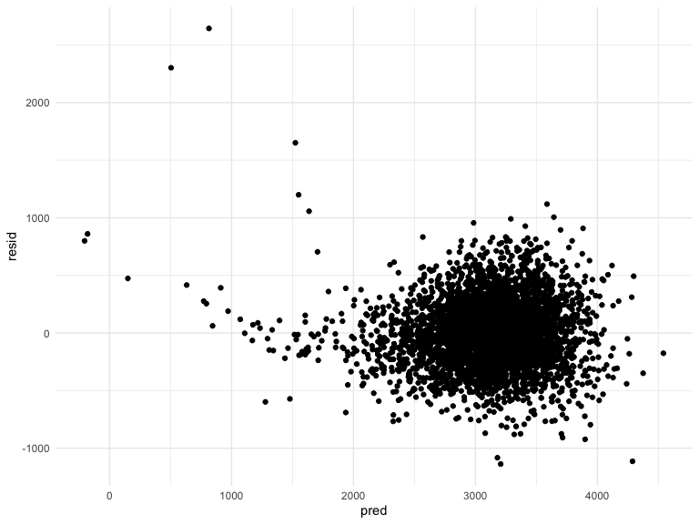
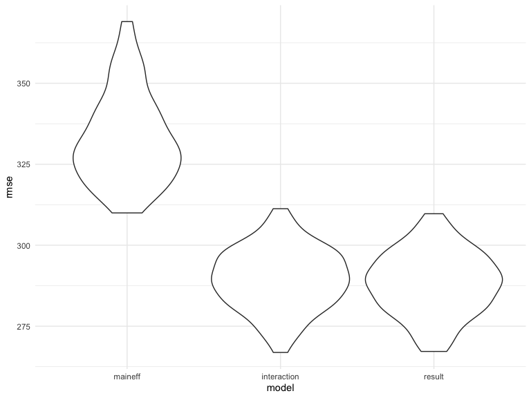

p8105\_hw6\_jck2183
================

## Problem 1

Import data

``` r
url <- "https://raw.githubusercontent.com/washingtonpost/data-homicides/master/homicide-data.csv"

download.file(url, destfile = "./data/homicide-data.csv")

homicide_df = 
    read_csv("./data/homicide-data.csv", na = c("", "NA", "Unknown")) %>% 
    mutate(
    city_state = str_c(city, state, sep = ", "),
    victim_age = as.numeric(victim_age),
    resolution = case_when(
      disposition == "Closed without arrest" ~ 0,
      disposition == "Open/No arrest"        ~ 0,
      disposition == "Closed by arrest"      ~ 1)
  ) %>% 
  filter(
    victim_race %in% c("White", "Black"),
    city_state != "Tulsa, AL") %>% 
  select(city_state, resolution, victim_age, victim_race, victim_sex)
```

    ## Parsed with column specification:
    ## cols(
    ##   uid = col_character(),
    ##   reported_date = col_double(),
    ##   victim_last = col_character(),
    ##   victim_first = col_character(),
    ##   victim_race = col_character(),
    ##   victim_age = col_double(),
    ##   victim_sex = col_character(),
    ##   city = col_character(),
    ##   state = col_character(),
    ##   lat = col_double(),
    ##   lon = col_double(),
    ##   disposition = col_character()
    ## )

Start with one city

``` r
baltimore_df =
  homicide_df %>% 
  filter(city_state == "Baltimore, MD")

glm(resolution ~ victim_age + victim_race + victim_sex, 
    data = baltimore_df,
    family = binomial()) %>% 
  broom::tidy() %>% 
  mutate(
    OR = exp(estimate),
    CI_lower = exp(estimate - 1.96 * std.error),
    CI_upper = exp(estimate + 1.96 * std.error)
  ) %>% 
  select(term, OR, starts_with("CI")) %>% 
  knitr::kable(digits = 3)
```

| term              |    OR | CI\_lower | CI\_upper |
| :---------------- | ----: | --------: | --------: |
| (Intercept)       | 1.363 |     0.975 |     1.907 |
| victim\_age       | 0.993 |     0.987 |     1.000 |
| victim\_raceWhite | 2.320 |     1.648 |     3.268 |
| victim\_sexMale   | 0.426 |     0.325 |     0.558 |

Try across city.

``` r
models_results_df = 
  homicide_df %>% 
  nest(data = -city_state) %>% 
  mutate(
    models = 
      map(.x = data, ~glm(resolution ~ victim_age + victim_race + victim_sex, data = .x, family = binomial())),
    results = map(models, broom::tidy)
  ) %>% 
  select(city_state, results) %>% 
  unnest(results) %>% 
  mutate(
    OR = exp(estimate),
    CI_lower = exp(estimate - 1.96 * std.error),
    CI_upper = exp(estimate + 1.96 * std.error)
  ) %>% 
  select(city_state, term, OR, starts_with("CI")) 
```

``` r
models_results_df %>% 
  filter(term == "victim_sexMale") %>% 
  mutate(city_state = fct_reorder(city_state, OR)) %>% 
  ggplot(aes(x = city_state, y = OR)) + 
  geom_point(color = "#A35E60") + 
  geom_errorbar(aes(ymin = CI_lower, ymax = CI_upper)) + 
  theme(axis.text.x = element_text(angle = 90, hjust = 1))
```


## Problem 2

Import Data

``` r
birth_df = 
  read_csv("./data/birthweight.csv", col_names = TRUE) %>% 
    janitor::clean_names() %>% 
    mutate(
        babysex = as.factor(babysex), 
        babysex = recode(babysex,
                         "1" = "male", 
                         "2" = "female"), 
                frace = as.factor(frace),
                frace = recode(
                    frace, 
                    "1" = "White", 
                    "2" = "Black", 
                    "3" = "Asian", 
                    "4" = "Puerto Rican", 
                    "8" = "Other", 
                    "9" = "Unknown"), 
        malform = as.factor(malform),
        malform = recode(
            malform,
            "0" = "absent", 
            "1" = "present"),
        mrace = as.factor(mrace),
        mrace = recode(
            frace, 
            "1" = "White", 
            "2" = "Black", 
            "3" = "Asian", 
            "4" = "Puerto Rican", 
            "8" = "Other", 
            "9" = "Unknown"),
        delwt = round(conv_unit(delwt, "lbs", "g"), digits = 0),
        ppwt = round(conv_unit(ppwt, "lbs", "g"), digits = 0),
        wtgain = round(conv_unit(wtgain, "lbs", "g"), digits = 0),
        mheight = round(conv_unit(mheight, "inch", "cm"), digits = 0)
    )
```

    ## Parsed with column specification:
    ## cols(
    ##   .default = col_double()
    ## )

    ## See spec(...) for full column specifications.

Fit a model : One using length at birth and gestational age as
predictors (main effects only).

``` r
model_maineff = lm(bwt ~ blength + gaweeks, data = birth_df) 
    

model_maineff %>% 
    broom::tidy() %>% 
    select(term, estimate, p.value) %>% 
    rename(
        "Term" = term, 
        "Estimate" = estimate, 
        "P-Value" = p.value
    ) 
```

    ## # A tibble: 3 x 3
    ##   Term        Estimate `P-Value`
    ##   <chr>          <dbl>     <dbl>
    ## 1 (Intercept)  -4348.   0.      
    ## 2 blength        129.   0.      
    ## 3 gaweeks         27.0  2.36e-54

``` r
birth_df %>% 
    add_residuals(model_maineff) %>%
    add_predictions(model_maineff) %>% 
    ggplot(aes(x = pred, y = resid)) + 
    geom_point()
```


Fit another model : One using head circumference, length, sex, and all
interactions (including the three-way interaction) between these.

``` r
model_interaction = 
    lm(bwt ~ bhead * blength * babysex, data = birth_df) 

    
model_interaction %>%     
    broom::tidy() %>% 
    select(term, estimate, p.value) %>% 
    rename(
        "Term" = term, 
        "Estimate" = estimate, 
        "P-Value" = p.value
    ) 
```

    ## # A tibble: 8 x 3
    ##   Term                         Estimate    `P-Value`
    ##   <chr>                           <dbl>        <dbl>
    ## 1 (Intercept)                 -7177.    0.0000000149
    ## 2 bhead                         182.    0.00000184  
    ## 3 blength                       102.    0.0000992   
    ## 4 babysexfemale                6375.    0.000147    
    ## 5 bhead:blength                  -0.554 0.478       
    ## 6 bhead:babysexfemale          -198.    0.000105    
    ## 7 blength:babysexfemale        -124.    0.000429    
    ## 8 bhead:blength:babysexfemale     3.88  0.000245

``` r
birth_df %>% 
    add_residuals(model_interaction) %>%
    add_predictions(model_interaction) %>% 
    ggplot(aes(x = pred, y = resid)) + 
    geom_point()
```


Compare the two model with Anova: H0: μ\_maineffect = μ\_interaction H1:
The means are not all equal.

``` r
anova(model_maineff, model_interaction) %>% 
    broom::tidy()
```

    ## # A tibble: 2 x 6
    ##   res.df        rss    df      sumsq statistic    p.value
    ##    <dbl>      <dbl> <dbl>      <dbl>     <dbl>      <dbl>
    ## 1   4339 481775846.    NA        NA        NA  NA        
    ## 2   4334 358816655.     5 122959191.      297.  4.74e-274

At 5% significance level, we can conclude that the average birth weight
for the model which only contains the main effect(length at birth and
gestational age) is different from the model including interaction
term(head circumference, length, sex, and all interactions between these
variables).

The variables I hypothesize that underlie baby’s birthweight include:
babysex, bhead, blength, delwt, gaweeks, momage, mrace, pnumlbw,
pnumsga, and smoken. And I will try to see individual predictor has
significant correlation with the birth weight or not.

``` r
uni_babysex = lm(bwt ~ babysex, data = birth_df) %>% 
    broom::tidy()  
    

birth_df %>% 
  ggplot(aes(x = babysex, y = bwt)) + 
  geom_point() + 
  geom_smooth(method = 'lm')
```

    ## `geom_smooth()` using formula 'y ~ x'


``` r
uni_bhead = lm(bwt ~ bhead, data = birth_df) %>% 
    broom::tidy()  

    
birth_df %>% 
  ggplot(aes(x = bhead, y = bwt)) + 
  geom_point() + 
  geom_smooth(method = 'lm')    
```

    ## `geom_smooth()` using formula 'y ~ x'


``` r
uni_delwt = lm(bwt ~ delwt, data = birth_df) %>% 
    broom::tidy() 

birth_df %>%
    ggplot(aes(x = delwt, y = bwt)) + 
    geom_point() + 
    geom_smooth(method = 'lm') 
```

    ## `geom_smooth()` using formula 'y ~ x'


``` r
uni_gaweeks = lm(bwt ~ gaweeks, data = birth_df) %>% 
    broom::tidy() 
 
birth_df %>% 
    ggplot(aes(x = gaweeks, y = bwt)) +
    geom_point() +
    geom_smooth(method = 'lm')
```

    ## `geom_smooth()` using formula 'y ~ x'


``` r
uni_momage = lm(bwt ~ momage, data = birth_df) %>% 
    broom::tidy() 
 
birth_df %>% 
    ggplot(aes(x = momage, y = bwt)) +
    geom_point() +
    geom_smooth(method = 'lm')
```

    ## `geom_smooth()` using formula 'y ~ x'


``` r
uni_mrace = lm(bwt ~ mrace, data = birth_df) %>% 
    broom::tidy() 
 
birth_df %>% 
    ggplot(aes(x = mrace, y = bwt)) +
    geom_point() +
    geom_smooth(method = 'lm')
```

    ## `geom_smooth()` using formula 'y ~ x'


``` r
uni_pnumlbw = lm(bwt ~ pnumlbw, data = birth_df) %>% 
    broom::tidy() 
 
birth_df %>% 
    ggplot(aes(x = pnumlbw, y = bwt)) +
    geom_point() +
    geom_smooth(method = 'lm')
```

    ## `geom_smooth()` using formula 'y ~ x'


pnumsga

``` r
uni_pnumlbw = lm(bwt ~ pnumsga, data = birth_df) %>% 
    broom::tidy() 
 
birth_df %>% 
    ggplot(aes(x = pnumsga, y = bwt)) +
    geom_point() +
    geom_smooth(method = 'lm')
```

    ## `geom_smooth()` using formula 'y ~ x'


smoken

``` r
uni_smoken = lm(bwt ~ smoken, data = birth_df) %>% 
    broom::tidy() 
 
birth_df %>% 
    ggplot(aes(x = smoken, y = bwt)) +
    geom_point() +
    geom_smooth(method = 'lm')
```

    ## `geom_smooth()` using formula 'y ~ x'


After examining each variable and the birth weight, I decided to keep
bhead, blength, gaweeks, momage, smoken, and the interaction between
gaweeks and bhead, blenghth, momage, and smoken respectively.

``` r
model_propose = lm(bwt ~ bhead + blength + gaweeks + momage + smoken + momage * bhead + momage * blength + momage * gaweeks + momage * smoken , data = birth_df) 


model_propose %>% 
    broom::tidy() %>% 
    filter(p.value < 0.05)
```

    ## # A tibble: 6 x 5
    ##   term            estimate std.error statistic  p.value
    ##   <chr>              <dbl>     <dbl>     <dbl>    <dbl>
    ## 1 (Intercept)    -5495.      529.       -10.4  5.71e-25
    ## 2 bhead            119.       19.2        6.20 6.02e-10
    ## 3 blength           96.7      11.1        8.71 4.13e-18
    ## 4 smoken             7.04      2.93       2.40 1.65e- 2
    ## 5 gaweeks:momage     1.21      0.392      3.10 1.97e- 3
    ## 6 momage:smoken     -0.426     0.135     -3.17 1.56e- 3

``` r
# 2.35e-1 -> 2.35 e-1 -> 2.25 x e-1 where e-1 = 10^-1
```

After comparing the p-value, we only include the predictors with
significant p-values.

``` r
result_model = lm(bwt ~ bhead + blength + momage + smoken + momage * smoken, data = birth_df) 

result_model %>% 
    broom::tidy() %>% 
    select(term, estimate, p.value)
```

    ## # A tibble: 6 x 3
    ##   term           estimate   p.value
    ##   <chr>             <dbl>     <dbl>
    ## 1 (Intercept)   -6111.    0.       
    ## 2 bhead           144.    4.93e-316
    ## 3 blength          84.5   8.54e-310
    ## 4 momage            8.82  3.21e- 12
    ## 5 smoken            8.29  5.01e-  3
    ## 6 momage:smoken    -0.471 5.18e-  4

``` r
birth_df %>% 
  add_residuals(result_model) %>% 
  modelr::add_predictions(result_model) %>% 
  ggplot(aes(x = pred, y = resid)) + 
  geom_point()
```



``` r
cv_df = 
  crossv_mc(birth_df, 100)
```

``` r
cv_df %>% 
    pull(train) %>% 
    .[[1]] %>% 
    as_tibble
```

    ## # A tibble: 3,473 x 20
    ##    babysex bhead blength   bwt delwt fincome frace gaweeks malform menarche
    ##    <fct>   <dbl>   <dbl> <dbl> <dbl>   <dbl> <fct>   <dbl> <fct>      <dbl>
    ##  1 female     34      51  3629 80286      35 White    39.9 absent        13
    ##  2 male       34      48  3062 70760      65 Black    25.9 absent        14
    ##  3 female     36      50  3345 67132      85 White    39.9 absent        12
    ##  4 male       34      52  3062 71214      55 White    40   absent        14
    ##  5 female     34      52  3374 70760       5 White    41.6 absent        13
    ##  6 male       33      52  3374 58513      55 White    40.7 absent        12
    ##  7 female     33      49  2778 63503       5 White    37.4 absent        12
    ##  8 male       36      52  3515 66224      85 White    40.3 absent        11
    ##  9 male       33      50  3459 76657      75 Black    40.7 absent        12
    ## 10 female     35      51  3317 58967      55 White    43.4 absent        13
    ## # … with 3,463 more rows, and 10 more variables: mheight <dbl>, momage <dbl>,
    ## #   mrace <fct>, parity <dbl>, pnumlbw <dbl>, pnumsga <dbl>, ppbmi <dbl>,
    ## #   ppwt <dbl>, smoken <dbl>, wtgain <dbl>

``` r
cv_df %>% 
    pull(test) %>% 
    .[[1]] %>% 
    as_tibble
```

    ## # A tibble: 869 x 20
    ##    babysex bhead blength   bwt delwt fincome frace gaweeks malform menarche
    ##    <fct>   <dbl>   <dbl> <dbl> <dbl>   <dbl> <fct>   <dbl> <fct>      <dbl>
    ##  1 female     33      46  2523 57153      96 Black    40.3 absent        14
    ##  2 male       35      51  3544 58513      65 White    39.6 absent        12
    ##  3 female     35      50  3175 63503      85 Black    40.6 absent        14
    ##  4 female     36      56  3685 77111      95 White    40.3 absent        12
    ##  5 male       34      63  3175 64864      25 White    41.9 absent        13
    ##  6 female     33      49  2948 58513      25 White    41   absent        13
    ##  7 male       35      53  3175 58967      45 White    40.4 absent        13
    ##  8 female     36      51  3317 61689      65 White    42.6 absent        14
    ##  9 female     34      54  3402 69853      75 White    40.7 absent        14
    ## 10 female     35      52  3487 54885      45 White    39.9 absent        11
    ## # … with 859 more rows, and 10 more variables: mheight <dbl>, momage <dbl>,
    ## #   mrace <fct>, parity <dbl>, pnumlbw <dbl>, pnumsga <dbl>, ppbmi <dbl>,
    ## #   ppwt <dbl>, smoken <dbl>, wtgain <dbl>

``` r
cv_df =
  cv_df %>% 
  mutate(
    train = map(train, as_tibble),
    test = map(test, as_tibble))
```

``` r
cv_df = 
  cv_df %>% 
  mutate(maineff_mod  = map(train, ~lm(bwt ~ blength + gaweeks, data = .x)),
         interaction_mod  = map(train, ~lm(bwt ~ bhead * blength * babysex, data = .x)),
         result_mod  = map(train, ~lm(bwt ~ bhead + blength + momage + smoken + momage * smoken, data = .x))) %>% 
  mutate(rmse_maineff = map2_dbl(maineff_mod, test, ~rmse(model = .x, data = .y)),
         rmse_interaction = map2_dbl(interaction_mod, test, ~rmse(model = .x, data = .y)),
         rmse_result = map2_dbl(result_mod, test, ~rmse(model = .x, data = .y)))
```

``` r
cv_df %>% 
  select(starts_with("rmse")) %>% 
  pivot_longer(
    everything(),
    names_to = "model", 
    values_to = "rmse",
    names_prefix = "rmse_") %>% 
  mutate(model = fct_inorder(model)) %>% 
  ggplot(aes(x = model, y = rmse)) + 
  geom_violin()
```


