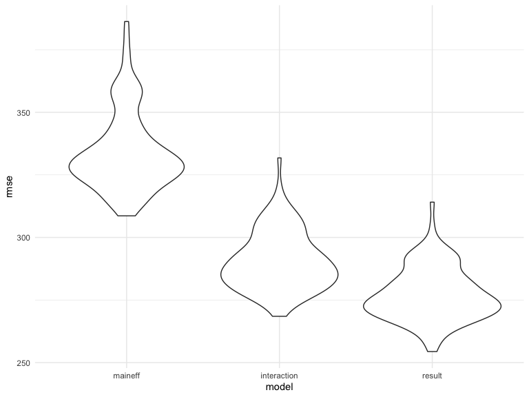

p8105\_hw6\_jck2183
================

## Problem 1

Import data

``` r
url <- "https://raw.githubusercontent.com/washingtonpost/data-homicides/master/homicide-data.csv"

download.file(url, destfile = "./data/homicide-data.csv")

homicide_df = 
    read_csv("./data/homicide-data.csv", na = c("", "NA", "Unknown")) %>% 
    mutate(
    city_state = str_c(city, state, sep = ", "),
    victim_age = as.numeric(victim_age),
    resolution = case_when(
      disposition == "Closed without arrest" ~ 0,
      disposition == "Open/No arrest"        ~ 0,
      disposition == "Closed by arrest"      ~ 1)
  ) %>% 
  filter(
    victim_race %in% c("White", "Black"),
    city_state != "Tulsa, AL") %>% 
  select(city_state, resolution, victim_age, victim_race, victim_sex)
```

    ## Parsed with column specification:
    ## cols(
    ##   uid = col_character(),
    ##   reported_date = col_double(),
    ##   victim_last = col_character(),
    ##   victim_first = col_character(),
    ##   victim_race = col_character(),
    ##   victim_age = col_double(),
    ##   victim_sex = col_character(),
    ##   city = col_character(),
    ##   state = col_character(),
    ##   lat = col_double(),
    ##   lon = col_double(),
    ##   disposition = col_character()
    ## )

Start with one city

``` r
baltimore_df =
  homicide_df %>% 
  filter(city_state == "Baltimore, MD")

glm(resolution ~ victim_age + victim_race + victim_sex, 
    data = baltimore_df,
    family = binomial()) %>% 
  broom::tidy() %>% 
  mutate(
    OR = exp(estimate),
    CI_lower = exp(estimate - 1.96 * std.error),
    CI_upper = exp(estimate + 1.96 * std.error)
  ) %>% 
  select(term, OR, starts_with("CI")) %>% 
  knitr::kable(digits = 3)
```

| term              |    OR | CI\_lower | CI\_upper |
| :---------------- | ----: | --------: | --------: |
| (Intercept)       | 1.363 |     0.975 |     1.907 |
| victim\_age       | 0.993 |     0.987 |     1.000 |
| victim\_raceWhite | 2.320 |     1.648 |     3.268 |
| victim\_sexMale   | 0.426 |     0.325 |     0.558 |

Try across city.

``` r
models_results_df = 
  homicide_df %>% 
  nest(data = -city_state) %>% 
  mutate(
    models = 
      map(.x = data, ~glm(resolution ~ victim_age + victim_race + victim_sex, data = .x, family = binomial())),
    results = map(models, broom::tidy)
  ) %>% 
  select(city_state, results) %>% 
  unnest(results) %>% 
  mutate(
    OR = exp(estimate),
    CI_lower = exp(estimate - 1.96 * std.error),
    CI_upper = exp(estimate + 1.96 * std.error)
  ) %>% 
  select(city_state, term, OR, starts_with("CI")) 
```

``` r
models_results_df %>% 
  filter(term == "victim_sexMale") %>% 
  mutate(city_state = fct_reorder(city_state, OR)) %>% 
  ggplot(aes(x = city_state, y = OR)) + 
  geom_point(color = "#A35E60") + 
  geom_errorbar(aes(ymin = CI_lower, ymax = CI_upper)) + 
  theme(axis.text.x = element_text(angle = 90, hjust = 1))
```


## Problem 2

Import Data

``` r
birth_df = 
  read_csv("./data/birthweight.csv", col_names = TRUE) %>% 
    janitor::clean_names() %>% 
    mutate(
        babysex = as.factor(babysex), 
        babysex = recode(babysex,
                         "1" = "male", 
                         "2" = "female"), 
                frace = as.factor(frace),
                frace = recode(
                    frace, 
                    "1" = "White", 
                    "2" = "Black", 
                    "3" = "Asian", 
                    "4" = "Puerto Rican", 
                    "8" = "Other", 
                    "9" = "Unknown"), 
        malform = as.factor(malform),
        malform = recode(
            malform,
            "0" = "absent", 
            "1" = "present"),
        mrace = as.factor(mrace),
        mrace = recode(
            frace, 
            "1" = "White", 
            "2" = "Black", 
            "3" = "Asian", 
            "4" = "Puerto Rican", 
            "8" = "Other", 
            "9" = "Unknown"),
        delwt = round(conv_unit(delwt, "lbs", "g"), digits = 0),
        ppwt = round(conv_unit(ppwt, "lbs", "g"), digits = 0),
        wtgain = round(conv_unit(wtgain, "lbs", "g"), digits = 0),
        mheight = round(conv_unit(mheight, "inch", "cm"), digits = 0)
    )
```

    ## Parsed with column specification:
    ## cols(
    ##   .default = col_double()
    ## )

    ## See spec(...) for full column specifications.

Fit a model : One using length at birth and gestational age as
predictors (main effects only).

``` r
model_maineff = lm(bwt ~ blength + gaweeks, data = birth_df) 
    

model_maineff %>% 
    broom::tidy() %>% 
    select(term, estimate, p.value) %>% 
    rename(
        "Term" = term, 
        "Estimate" = estimate, 
        "P-Value" = p.value
    ) %>% 
    knitr::kable(digits = 4)
```

| Term        |    Estimate | P-Value |
| :---------- | ----------: | ------: |
| (Intercept) | \-4347.6671 |       0 |
| blength     |    128.5557 |       0 |
| gaweeks     |     27.0467 |       0 |

``` r
birth_df %>% 
    add_residuals(model_maineff) %>%
    add_predictions(model_maineff) %>% 
    ggplot(aes(x = pred, y = resid)) + 
    geom_point()
```


Fit another model : One using head circumference, length, sex, and all
interactions (including the three-way interaction) between these.

``` r
model_interaction = 
    lm(bwt ~ bhead * blength * babysex, data = birth_df) 

    
model_interaction %>%     
    broom::tidy() %>% 
    select(term, estimate, p.value) %>% 
    rename(
        "Term" = term, 
        "Estimate" = estimate, 
        "P-Value" = p.value
    ) %>% 
    knitr::kable(digits = 4)
```

| Term                        |    Estimate | P-Value |
| :-------------------------- | ----------: | ------: |
| (Intercept)                 | \-7176.8170 |  0.0000 |
| bhead                       |    181.7956 |  0.0000 |
| blength                     |    102.1269 |  0.0001 |
| babysexfemale               |   6374.8684 |  0.0001 |
| bhead:blength               |    \-0.5536 |  0.4780 |
| bhead:babysexfemale         |  \-198.3932 |  0.0001 |
| blength:babysexfemale       |  \-123.7729 |  0.0004 |
| bhead:blength:babysexfemale |      3.8781 |  0.0002 |

``` r
birth_df %>% 
    add_residuals(model_interaction) %>%
    add_predictions(model_interaction) %>% 
    ggplot(aes(x = pred, y = resid)) + 
    geom_point()
```


Compare the two model with Anova: H0: μ\_maineffect = μ\_interaction H1:
The means are not all equal.

``` r
anova(model_maineff, model_interaction) %>% 
    broom::tidy() %>% 
    knitr::kable(digits = 4)
```

| res.df |       rss | df |     sumsq | statistic | p.value |
| -----: | --------: | -: | --------: | --------: | ------: |
|   4339 | 481775846 | NA |        NA |        NA |      NA |
|   4334 | 358816655 |  5 | 122959191 |  297.0348 |       0 |

At 5% significance level, we can conclude that the average birth weight
for the model which only contains the main effect(length at birth and
gestational age) is different from the model including interaction
term(head circumference, length, sex, and all interactions between these
variables).

The variables I hypothesize that underlie baby’s birthweight include:
babysex, bhead, blength, delwt, gaweeks, momage, mrace, pnumlbw,
pnumsga, and smoken. And I will try to see individual predictor has
significant correlation with the birth weight or not.

``` r
uni_babysex = 
    lm(bwt ~ babysex, data = birth_df) %>% 
    broom::tidy()  

  
birth_df %>% 
  ggplot(aes(x = babysex, y = bwt)) + 
  geom_point() + 
  geom_smooth(method = 'lm')
```

    ## `geom_smooth()` using formula 'y ~ x'


``` r
uni_bhead = lm(bwt ~ bhead, data = birth_df) %>% 
    broom::tidy()  


birth_df %>% 
  ggplot(aes(x = bhead, y = bwt)) + 
  geom_point() + 
  geom_smooth(method = 'lm')    
```

    ## `geom_smooth()` using formula 'y ~ x'


``` r
uni_delwt = lm(bwt ~ delwt, data = birth_df) %>% 
    broom::tidy() 

birth_df %>%
    ggplot(aes(x = delwt, y = bwt)) + 
    geom_point() + 
    geom_smooth(method = 'lm') 
```

    ## `geom_smooth()` using formula 'y ~ x'


``` r
uni_gaweeks = lm(bwt ~ gaweeks, data = birth_df) %>% 
    broom::tidy() 

 
birth_df %>% 
    ggplot(aes(x = gaweeks, y = bwt)) +
    geom_point() +
    geom_smooth(method = 'lm')
```

    ## `geom_smooth()` using formula 'y ~ x'


``` r
uni_momage = lm(bwt ~ momage, data = birth_df) %>% 
    broom::tidy() 

birth_df %>% 
    ggplot(aes(x = momage, y = bwt)) +
    geom_point() +
    geom_smooth(method = 'lm')
```

    ## `geom_smooth()` using formula 'y ~ x'


``` r
uni_mrace = lm(bwt ~ mrace, data = birth_df) %>% 
    broom::tidy() 

 
birth_df %>% 
    ggplot(aes(x = mrace, y = bwt)) +
    geom_point() +
    geom_smooth(method = 'lm')
```

    ## `geom_smooth()` using formula 'y ~ x'


``` r
uni_pnumlbw = lm(bwt ~ pnumlbw, data = birth_df) %>% 
    broom::tidy() 


birth_df %>% 
    ggplot(aes(x = pnumlbw, y = bwt)) +
    geom_point() +
    geom_smooth(method = 'lm')
```

    ## `geom_smooth()` using formula 'y ~ x'


``` r
uni_pnumsga = lm(bwt ~ pnumsga, data = birth_df) %>% 
    broom::tidy() 
 
birth_df %>% 
    ggplot(aes(x = pnumsga, y = bwt)) +
    geom_point() +
    geom_smooth(method = 'lm')
```

    ## `geom_smooth()` using formula 'y ~ x'


``` r
uni_smoken = lm(bwt ~ smoken, data = birth_df) %>% 
    broom::tidy() 

 
birth_df %>% 
    ggplot(aes(x = smoken, y = bwt)) +
    geom_point() +
    geom_smooth(method = 'lm')
```

    ## `geom_smooth()` using formula 'y ~ x'


Check the correlation between birth weight and all numeric variables.

``` r
correlation_fun =
    function(x) {
        if (!is.numeric(x)) {
           stop("X input must be numeric")   
        }
        corr = cor.test(x, birth_df$bwt, method = c("pearson", "kendall", "spearman")) %>% 
            broom::tidy() %>% 
            pull(estimate)
            
        
        return(corr)
    }
```

``` r
bind_rows(
    correlation_fun(birth_df$bhead),
    correlation_fun(birth_df$blength),
    correlation_fun(birth_df$delwt),
    correlation_fun(birth_df$fincome),
    correlation_fun(birth_df$gaweeks), 
    correlation_fun(birth_df$mheight), 
    correlation_fun(birth_df$momage), 
    correlation_fun(birth_df$ppbmi), 
    correlation_fun(birth_df$ppwt), 
    correlation_fun(birth_df$smoken), 
    correlation_fun(birth_df$wtgain)
) %>% add_column( variable =
    c("bhead", "blength", "delwt", "fincome",
      "gaweeks", "mheight", "momage", "ppbmi", "ppwt", 
      "smoken", "wtgain"), .before = "cor"
) %>% 
    knitr::kable(digit = 4)
```

| variable |      cor |
| :------- | -------: |
| bhead    |   0.7471 |
| blength  |   0.7435 |
| delwt    |   0.2879 |
| fincome  |   0.1546 |
| gaweeks  |   0.4122 |
| mheight  |   0.1926 |
| momage   |   0.1358 |
| ppbmi    |   0.0939 |
| ppwt     |   0.1829 |
| smoken   | \-0.0756 |
| wtgain   |   0.2473 |

After examining the correlation between birth weights and the
distribution of observation with plots, we only include the predictors
which seems to associate with birth weight.

``` r
result_model = lm(bwt ~ bhead + blength + mheight + delwt + gaweeks + wtgain + mrace , data = birth_df) 

result_model %>% 
    broom::tidy() %>% 
    select(term, estimate, p.value) %>% 
    knitr::kable(digits = 4)
```

| term              |    estimate | p.value |
| :---------------- | ----------: | ------: |
| (Intercept)       | \-6162.5411 |  0.0000 |
| bhead             |    131.0316 |  0.0000 |
| blength           |     76.0680 |  0.0000 |
| mheight           |      2.6874 |  0.0001 |
| delwt             |      0.0030 |  0.0000 |
| gaweeks           |     11.4683 |  0.0000 |
| wtgain            |      0.0057 |  0.0000 |
| mraceBlack        |  \-122.2714 |  0.0000 |
| mraceAsian        |   \-36.6955 |  0.3729 |
| mracePuerto Rican |   \-89.2045 |  0.0000 |
| mraceOther        |   \-46.9357 |  0.5253 |

``` r
birth_df %>% 
  add_residuals(result_model) %>% 
  modelr::add_predictions(result_model) %>% 
  ggplot(aes(x = pred, y = resid)) + 
  geom_point()
```


``` r
cv_df = 
  crossv_mc(birth_df, 100)
```

``` r
cv_df %>% 
    pull(train) %>% 
    .[[1]] %>% 
    as_tibble 
```

``` r
cv_df %>% 
    pull(test) %>% 
    .[[1]] %>% 
    as_tibble 
```

``` r
cv_df =
  cv_df %>% 
  mutate(
    train = map(train, as_tibble),
    test = map(test, as_tibble))
```

``` r
cv_df = 
  cv_df %>% 
  mutate(maineff_mod  = map(train, ~lm(bwt ~ blength + gaweeks, data = .x)),
         interaction_mod  = map(train, ~lm(bwt ~ bhead * blength * babysex, data = .x)),
         result_mod  = map(train, ~lm(bwt ~ bhead + blength + mheight + delwt + gaweeks + wtgain + mrace, data = .x))) %>% 
  mutate(rmse_maineff = map2_dbl(maineff_mod, test, ~rmse(model = .x, data = .y)),
         rmse_interaction = map2_dbl(interaction_mod, test, ~rmse(model = .x, data = .y)),
         rmse_result = map2_dbl(result_mod, test, ~rmse(model = .x, data = .y)))
```

``` r
cv_df %>% 
  select(starts_with("rmse")) %>% 
  pivot_longer(
    everything(),
    names_to = "model", 
    values_to = "rmse",
    names_prefix = "rmse_") %>% 
  mutate(model = fct_inorder(model)) %>% 
  ggplot(aes(x = model, y = rmse)) + 
  geom_violin()
```



Comparing each models with different RMSEs, we find that the main effect
model has the largest RMSE, while interaction model and result model we
proposed has smaller RMSEs compared to main effect one. Among them,
result model we proposed perform slightly better than the interaction
model according to the smaller RMSE we observed.

## Problem 3

Import Data

``` r
weather_df = 
  rnoaa::meteo_pull_monitors(
    c("USW00094728"),
    var = c("PRCP", "TMIN", "TMAX"), 
    date_min = "2017-01-01",
    date_max = "2017-12-31") %>%
  mutate(
    name = recode(id, USW00094728 = "CentralPark_NY"),
    tmin = tmin / 10,
    tmax = tmax / 10) %>%
  select(name, id, everything())
```

Write down the bootstrap function and draw repeated samples with
replacement.Using the 5000 bootstrap estimates.

``` r
set.seed(6)

boot_sample = function(df) {
    sample_frac(df, replace = TRUE) 
}

boot_strap =
    tibble(
        strap_number = 1:5000, 
        strap_sample = rerun(5000, boot_sample(weather_df))
    )
```

We’ll focus on a simple linear regression with tmax as the response and
tmin as the predictor, and are interested in the distribution of two
quantities estimated from these data:

### Computing and plotting distribution of r-square values:

``` r
boot_rsquared =
    boot_strap %>% 
    mutate(
        models = map(strap_sample, ~lm(tmax ~ tmin, data = .x)), 
        results = map(models, broom::glance)
    ) %>% 
    select(strap_number, results) %>% 
    unnest(results) %>% 
    select(strap_number, r.squared)


boot_rsquared %>% 
  ggplot(aes(x = r.squared)) + 
  geom_density(color = "dark red") +
  geom_vline(aes(xintercept = mean(r.squared), color = "black"), linetype = "dashed") +
  theme(legend.position = "none")
```


The distribution of r-square values is left-skewed with a slightly heavy
tail extending to low values.

``` r
boot_rsquared %>% 
    summarise(
        ci_lower = quantile(r.squared, 0.025), 
        ci_upper = quantile(r.squared, 0.975)
    ) %>% 
    knitr::kable()
```

| ci\_lower | ci\_upper |
| --------: | --------: |
| 0.8939899 |  0.927206 |

The 95% confidence interval of r-square values is (0.89, 0.93).

### Computing and plotting distribution of log(β̂ 0∗β̂ 1)values:

``` r
boot_logbeta =
    boot_strap %>% 
    mutate(
        models = map(strap_sample, ~lm(tmax ~ tmin, data = .x)), 
        results = map(models, broom::tidy)
    ) %>% 
    select(-strap_sample, -models) %>% 
    unnest(results) %>% 
    select(strap_number, term, estimate) %>% 
    pivot_wider(
    names_from = term,
    values_from = estimate) %>% 
    rename("b0" = "(Intercept)", 
           "b1" = "tmin") %>% 
    mutate(logbeta = log(b0 * b1))


boot_logbeta %>% 
  ggplot(aes(x = logbeta)) + 
  geom_density(color = "dark red") +
  geom_vline(aes(xintercept = mean(logbeta), color = "black"), linetype = "dashed") +
  theme(legend.position = "none")
```


The distribution of log(β̂ 0∗β̂ 1) values is normally distributed.

``` r
boot_logbeta %>% 
    summarise(
        ci_lower = quantile(logbeta, 0.025), 
        ci_upper = quantile(logbeta, 0.975)
    ) %>% 
    knitr::kable()
```

| ci\_lower | ci\_upper |
| --------: | --------: |
|  1.964744 |   2.05859 |

The 95% confidence interval of log(β̂ 0∗β̂ 1) value is (1.97, 2.06).
